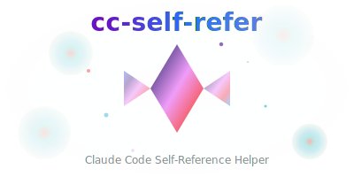

<div align="center">
  
</div>

# cc-self-refer

**Claude Code Self-Reference Helper** - The missing backend for intelligent development workflows with AI assistance.

## What is cc-self-refer?

`cc-self-refer` is a high-performance Node.js CLI that powers Claude Code's self-referential development capabilities. It enables projects to maintain their own context, specification repository, and development patterns that Claude can reference and build upon across sessions.

## Why do you need this?

### The Problem

- **Context Loss**: AI conversations lose context between sessions
- **Repeated Explanations**: You constantly re-explain project architecture, decisions, and patterns
- **Specifications Scattered**: Technical specifications, code patterns, and planning documents are spread across different tools
- **Inefficient Workflows**: No systematic way to build and reference project-specific specifications

### The Solution

`cc-self-refer` creates a **persistent, searchable specification layer** for your projects that Claude Code can intelligently reference:

- 📋 **Strategic Plans**: Document and iterate on high-level project planning
- 📄 **Session History**: Preserve development context across Claude sessions
- 🧩 **Code Patterns**: Build a library of reusable, project-specific code templates
- 📋 **Project Specifications**: Maintain comprehensive project planning including business requirements, user experience, technical architecture, and operational procedures
- 📝 **Coding Guidelines**: Project-specific coding standards and best practices
- 🔍 **Intelligent Search**: Find relevant information instantly with semantic search

## Quick Setup

### 0. Install Package (Recommended)

```bash
pnpm add -D cc-self-refer # or other package manager installation command
```

### 1. Run Initialization Commands

```bash
# Download commands & other stuffs for self refer structure
npx cc-self-refer get-commands

# During setup, pick the active agent when prompted (defaults to Claude).
```

### 2. Run your **claude-code** in your project root and pass this prompt.

```bash
The following commands will print the prompt out for setting up claude code self referring context management system.

Run `npx cc-self-refer init-get-prompt` and follow instructions step by step.

- You shouldn\'t fill [PATTERN LIST] at now.
- Copy the content into the agent prompt file defined in `.claude/self-refer.json` (default is `CLAUDE.md`).
```

That's it! Your project now has intelligent self-reference capabilities.

Restart claude-code and start create spec file with `/spec` command.

## What Gets Created

After running `/init-claude`, your project will have:

```
your-project/
├── CLAUDE.md / AGENTS.md / GEMINI.md # 📜 Agent-specific project overview (see `.claude/self-refer.json` for the active file)
├── .claude/
│   ├── commands/           # 🎯 Claude Code Commands
│   │   ├── plan-create.md # Create strategic plans
│   │   ├── plan-edit.md   # Edit existing plans
│   │   ├── plan-resolve.md# View and load plans
│   │   ├── page-save.md   # Session management
│   │   ├── page-refer.md  # Load session context
│   │   ├── spec-refer.md # Access technical specifications
│   │   ├── spec.md # Interactive specification planning
│   │   ├── pattern-use.md # Apply code patterns
│   │   ├── pattern-create.md     # Save new patterns
│   │   └── guide-create.md       # Create coding guidelines
│   │
│   ├── plans/             # 📋 Strategic Plans & Architecture
│   │   └── [numbered plans like: 001-user-authentication.md]
│   │
│   ├── pages/             # 📄 Session History & Context
│   │   └── [numbered sessions like: 001-login-implementation.md]
│   │
│   ├── patterns/     # 🧩 Reusable Code Templates
│   │   └── [numbered patterns like: 001-react-hook.md]
│   │
│   ├── self-refer.json # ⚙️ Active agent configuration
│   │
│   └── specs/         # 📋 Project Specification Repository
│       └── [numbered entries like: 001-api-limits.md]
└── [your project files]
```

## How Each Directory Works

### 📋 `.claude/plans/` - Strategic Planning

- **Purpose**: High-level project planning and architecture decisions
- **Usage**:
  - `/plan-create` creates comprehensive planning documents interactively
  - `/plan-resolve "id|keyword"` views and loads plans for reference
- **Content**: Implementation phases, success criteria, technical decisions, risk assessment
- **AI Benefit**: Claude references these plans to understand project direction and constraints

### 📄 `.claude/pages/` - Session Context

- **Purpose**: Preserve development context between Claude sessions
- **Usage**: Automatically captures session state; `/page-refer` to load previous context
- **Content**: Code changes, decisions made, problems solved, next steps
- **AI Benefit**: Eliminates need to re-explain project status each session

### 🧩 `.claude/patterns/` - Reusable Templates

- **Purpose**: Project-specific code patterns and templates
- **Usage**: `/pattern-create` to save patterns; `/pattern-use` to apply them
- **Content**: Component templates, utility functions, configuration patterns
- **AI Benefit**: Claude can apply your established patterns instead of generic solutions

### 📋 `.claude/specs/` - Project Specifications

- **Purpose**: Comprehensive project planning including business requirements, user experience design, technical architecture, and operational procedures
- **Usage**: `/spec-refer` to access; `/spec` for interactive project planning; manually curated project specifications
- **Content**: Business logic, user flows, feature requirements, technical design, operational workflows, project constraints
- **AI Benefit**: Claude makes informed decisions aligned with your complete project vision and requirements

### 📝 `CLAUDE.md` - Coding Guidelines

- **Purpose**: Project-specific coding standards and best practices stored directly in CLAUDE.md
- **Usage**: `/guide-create` to add new guidelines; automatically referenced by Claude
- **Content**: Code style rules, library preferences, architectural conventions, error handling patterns
- **AI Benefit**: Claude follows your established coding standards and project conventions automatically

## Why This Works

Each directory serves a specific purpose in building **persistent AI context**:

1. **Plans** provide strategic direction
2. **Pages** maintain session continuity
3. **Patterns** ensure consistency
4. **Specifications** provide comprehensive project guidance
5. **Guidelines** enforce coding standards

The result: Claude becomes increasingly intelligent about your specific project over time.

---

## Todo

- Page search with date
- Spec shouldn't include any code.(make it manage more higher blueprint)
- Test
- Docs
  - how to use for good
  - what are each component
  - guide & tip
- Guide files on init

## Contributing

See [CONTRIBUTING.md](CONTRIBUTING.md) for development setup and contribution guidelines.

## License

MIT © 2025 MJ Studio
