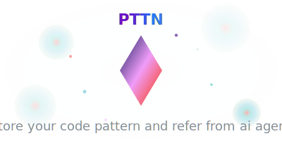

<div align="center">
  
</div>

# pttn

**Claude Code Pattern Helper** - The missing backend for intelligent development workflows with AI assistance.

## What is pttn?

`pttn` is a high-performance Node.js CLI that powers Claude Code's pattern management capabilities. It enables projects to maintain their own development patterns that Claude can reference and build upon across sessions.

## Why do you need this?

### The Problem

- **Context Loss**: AI conversations lose context between sessions
- **Repeated Patterns**: You constantly re-explain project architecture, decisions, and patterns
- **Code Templates Scattered**: Code patterns and templates are spread across different tools
- **Inefficient Workflows**: No systematic way to build and reference project-specific code patterns

### The Solution

`pttn` creates a **persistent, searchable pattern library** for your projects that Claude Code can intelligently reference:

- 🧩 **Code Patterns**: Build a library of reusable, project-specific code templates
- 📝 **Coding Guidelines**: Project-specific coding standards and best practices
- 🔍 **Intelligent Search**: Find relevant information instantly with semantic search

## Quick Setup

### 0. Install Package (Recommended)

```bash
pnpm add -D pttn # or other package manager installation command
```

### 1. Run Initialization Commands

```bash
# Download commands & other stuffs for pattern structure
npx pttn get-commands
```

### 2. Run your **claude-code** in your project root and pass this prompt.

```bash
The following commands will print the prompt out for setting up claude code pattern management system.

Run `npx pttn init-get-prompt` and follow instructions step by step.

- You shouldn\'t fill [PATTERN LIST] at now.
- Copy exactly same content from the CLAUDE.md content of the prompt.
```

That's it! Your project now has intelligent self-reference capabilities.

Restart claude-code and start creating patterns with `/pttn-create` command.

## What Gets Created

After running `/init-claude`, your project will have:

```
your-project/
├── CLAUDE.md              # 📜 Project Overview for Claude and command usages (merged if exists)
├── .claude/
│   ├── commands/           # 🎯 Claude Code Commands
│   │   ├── pttn-use.md # Apply code patterns
│   │   ├── pttn-create.md     # Save new patterns
│   │   └── guide-create.md       # Create coding guidelines
│   │
│   └── patterns/     # 🧩 Reusable Code Templates
│       └── [numbered patterns like: 001-react-hook.md]
└── [your project files]
```

## How It Works

### 🧩 `.claude/patterns/` - Reusable Templates

- **Purpose**: Project-specific code patterns and templates
- **Usage**: `/pttn-create` to save patterns; `/pttn-use` to apply them
- **Content**: Component templates, utility functions, configuration patterns
- **AI Benefit**: Claude can apply your established patterns instead of generic solutions

### 📝 `CLAUDE.md` - Coding Guidelines

- **Purpose**: Project-specific coding standards and best practices stored directly in CLAUDE.md
- **Usage**: `/guide-create` to add new guidelines; automatically referenced by Claude
- **Content**: Code style rules, library preferences, architectural conventions, error handling patterns
- **AI Benefit**: Claude follows your established coding standards and project conventions automatically

## Why This Works

The tool builds **persistent AI context** through:

1. **Patterns** ensure consistency across your codebase
2. **Guidelines** enforce coding standards

The result: Claude becomes increasingly intelligent about your specific project over time.

---

## Todo

- Test
- Docs
  - how to use for good
  - what are each component
  - guide & tip
- Guide files on init

## Contributing

See [CONTRIBUTING.md](CONTRIBUTING.md) for development setup and contribution guidelines.

## License

MIT © 2025 MJ Studio
