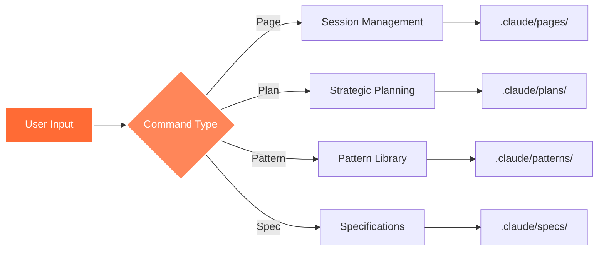

# Commands Overview

cc-self-refer provides a comprehensive set of commands for managing your project context. These commands are available both through the CLI and as Claude Code slash commands.

## Command Categories

### 📝 Page Commands

Session history and conversation management:

- **[/page-save](./page-save)** - Page Save - Session History Dump with Citations and Memory Management
- **[/page-refer](./page-refer)** - Refer Page - Load Session History Context

### 📋 Plan Commands

Strategic planning and task management:

- **[/plan-resolve](./plan-resolve)** - Plan Resolve - Execute Strategic Plans and Mark Complete
- **[/plan-create](./plan-create)** - Plan Create - Create New Implementation Planning Document

### 🎨 Pattern Commands

Code pattern library management:

- **[/pattern-use](./pattern-use)** - Use Code Pattern - Apply Predefined Code Patterns
- **[/pattern-create](./pattern-create)** - Code Pattern - Save Reusable Code Patterns

### 📚 Spec Commands

Project specification management:

- **[/spec](./spec)** - Spec - Adaptive Interactive Project Planning System
- **[/spec-refer](./spec-refer)** - Refer Spec - Access Project Specifications

## Quick Reference

| Command | Purpose | CLI Equivalent |
|---------|---------|----------------|
| `/spec` | Spec - Adaptive Interactive Project Planning System | `cc-self-refer spec` |
| `/spec-refer` | Refer Spec - Access Project Specifications | `cc-self-refer spec` |
| `/plan-resolve` | Plan Resolve - Execute Strategic Plans and Mark Complete | `cc-self-refer plan` |
| `/plan-create` | Plan Create - Create New Implementation Planning Document | `cc-self-refer plan` |
| `/pattern-use` | Use Code Pattern - Apply Predefined Code Patterns | `cc-self-refer pattern` |
| `/pattern-create` | Code Pattern - Save Reusable Code Patterns | `cc-self-refer pattern` |
| `/page-save` | Page Save - Session History Dump with Citations and Memory Management | `cc-self-refer page` |
| `/page-refer` | Refer Page - Load Session History Context | `cc-self-refer page` |

## Using Commands

### In Claude Code

Simply type the slash command in your conversation:

```
/spec-refer authentication
```

### Via CLI

Use the cc-self-refer CLI directly:

```bash
cc-self-refer spec view authentication
```

## Command Workflow



## Best Practices

1. **Start with Specs**: Define your project requirements first
2. **Create Plans**: Break down implementations into manageable tasks
3. **Save Patterns**: Extract reusable code for consistency
4. **Reference Pages**: Use historical context for continuity

## Getting Help

- Use `--help` flag with any CLI command
- Check individual command documentation
- Visit our [GitHub repository](https://github.com/your-username/cc-self-refer) for issues
