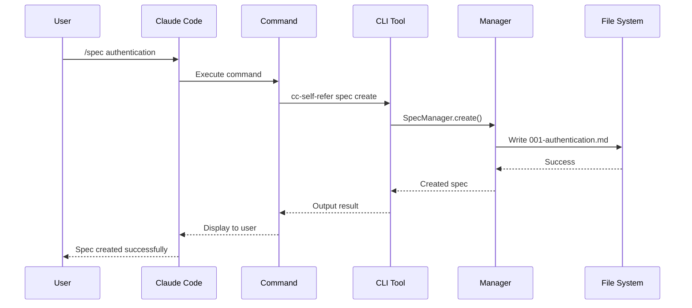
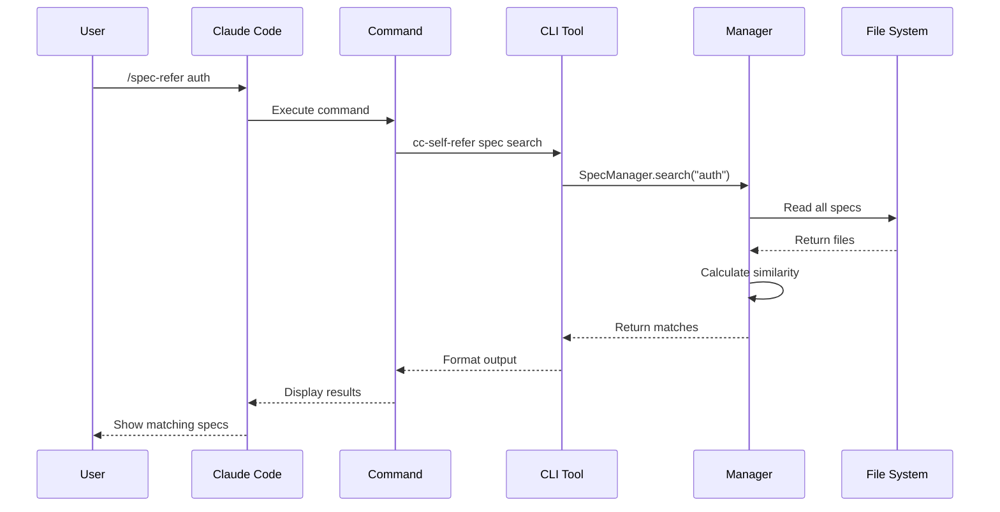

import SelfReferDiagram from '@site/src/components/SelfReferDiagram';

# Architecture Overview

cc-self-refer implements a layered architecture designed to seamlessly integrate with Claude Code while maintaining clean separation of concerns.

<SelfReferDiagram />

## System Components

### 1. Claude Code Layer

The top layer consists of Claude Code and its slash command system:

- **Claude Code**: The AI assistant that processes user requests
- **Slash Commands**: Custom commands in `.claude/commands/` that trigger cc-self-refer functionality
- **Context Awareness**: Ability to read and reference stored context

### 2. CLI Tool Layer

The middle layer provides the core functionality:

- **CLI Interface**: Command-line interface built with Commander.js
- **Content Managers**: Specialized managers for each content type (pages, plans, patterns, specs)
- **Search Engine**: Natural.js-powered semantic search with Jaro-Winkler distance
- **File Operations**: fs-extra for robust file system operations

### 3. Storage Layer

The bottom layer manages persistent storage:

- **`.claude/` Directory**: Root directory for all context storage
- **Markdown Files**: All content stored as searchable markdown with frontmatter
- **Numbered Naming**: Consistent `NNN-title.md` format for organization
- **Git Compatible**: Plain text files work seamlessly with version control

## Data Flow

### Write Operations



### Read Operations



## Directory Structure

```
project-root/
├── .claude/
│   ├── commands/          # Claude Code slash commands
│   │   ├── page-save.md
│   │   ├── page-refer.md
│   │   ├── plan-create.md
│   │   ├── pattern-create.md
│   │   ├── spec.md
│   │   └── ...
│   ├── pages/             # Session history
│   │   ├── 001-initial-setup.md
│   │   ├── 002-authentication.md
│   │   └── ...
│   ├── plans/             # Strategic plans
│   │   ├── 001-mvp-roadmap.md
│   │   ├── 002-scaling-strategy.md
│   │   └── ...
│   ├── patterns/          # Code patterns
│   │   ├── 001-repository-pattern.md
│   │   ├── 002-error-handling.md
│   │   └── ...
│   └── specs/             # Specifications
│       ├── 001-user-authentication.md
│       ├── 002-data-model.md
│       └── ...
└── src/                   # Your project code
```

## Manager Architecture

Each content type has a dedicated manager with consistent interface:

### Base Interface

```typescript
interface ContentManager<T> {
  create(title: string, content: string): Promise<number>;
  list(): Promise<T[]>;
  view(id: number): Promise<T | null>;
  search(query: string): Promise<T[]>;
  delete(id: number): Promise<boolean>;
}
```

### Manager Implementations

- **PageManager**: Handles session extraction and history
- **PlanManager**: Manages strategic planning documents
- **PatternManager**: Stores reusable code patterns
- **SpecManager**: Maintains project specifications

## Search Algorithm

The search functionality uses a multi-factor scoring system:

1. **Jaro-Winkler Distance**: Measures string similarity
2. **Keyword Matching**: Exact and partial keyword matches
3. **Title Priority**: Matches in titles score higher
4. **Content Scanning**: Full-text search in content body

```javascript
// Simplified search algorithm
const calculateScore = (query, document) => {
  const titleScore = jaroWinkler(query, document.title) * 2;
  const contentScore = jaroWinkler(query, document.content);
  const keywordBonus = countKeywordMatches(query, document) * 0.5;
  
  return titleScore + contentScore + keywordBonus;
};
```

## File Format

All content files follow a consistent markdown format:

```markdown
---
id: 1
title: Authentication System
created: 2024-01-15T10:30:00Z
updated: 2024-01-15T14:45:00Z
tags: [auth, security, jwt]
---

# Authentication System

## Overview
[Content here...]

## Details
[More content...]
```

## Integration Points

### Claude Code Integration

1. **Command Templates**: Markdown files in `.claude/commands/`
2. **Direct CLI Access**: Commands execute `npx cc-self-refer`
3. **Context Reading**: Claude can read any file in `.claude/`

### Git Integration

- All files are plain text markdown
- Works with any git workflow
- Supports branching and merging
- Can be included in version control

### IDE Integration

- Standard file formats readable by any editor
- Markdown preview support
- Search functionality via IDE
- Direct file editing possible

## Performance Considerations

### Optimization Strategies

1. **Lazy Loading**: Content loaded only when needed
2. **Indexed Search**: File metadata cached for fast lookup
3. **Incremental Updates**: Only changed files reprocessed
4. **Parallel Operations**: Multiple file operations batched

### Scalability

- Supports hundreds of documents per category
- Search remains fast with Jaro-Winkler algorithm
- File system based for simplicity and reliability
- No database dependencies

## Security Considerations

1. **Local Storage**: All data stored locally in project
2. **No Network Calls**: Operates entirely offline
3. **Permission Model**: Respects file system permissions
4. **Gitignore Ready**: Can exclude sensitive content

## Future Architecture Considerations

### Potential Enhancements

- **Plugin System**: Extensible manager types
- **Remote Storage**: Optional cloud sync
- **Collaborative Features**: Multi-user support
- **Advanced Search**: ML-powered semantic search
- **Versioning**: Built-in document versioning

### Maintaining Simplicity

The architecture prioritizes:
- Zero configuration setup
- No external dependencies
- File system as source of truth
- Human-readable storage format
- Git-friendly operation