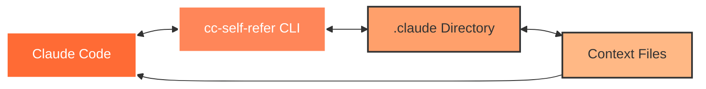
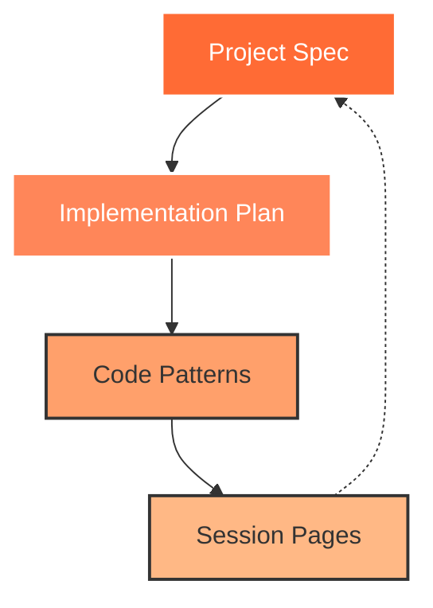

# The Self-Referring Model

The Self-Referring Model is the core concept behind cc-self-refer. It enables Claude Code to maintain context awareness across sessions by creating a feedback loop where the AI can reference its own previous work.

## Conceptual Overview



## How Self-Reference Works

### 1. Context Capture
When you work with Claude Code, important information is generated:
- Solutions to problems
- Architectural decisions
- Implementation strategies
- Code patterns

### 2. Context Storage
cc-self-refer provides structured storage for this information:
- **Pages**: Session conversations and history
- **Plans**: Strategic implementation roadmaps
- **Patterns**: Reusable code templates
- **Specs**: Project specifications

### 3. Context Retrieval
In future sessions, Claude Code can:
- Search previous conversations
- Reference established patterns
- Follow existing plans
- Consult project specifications

### 4. Context Application
Retrieved context enables:
- Consistent implementations
- Informed decision-making
- Incremental progress
- Knowledge accumulation

## Benefits of Self-Reference

### Consistency
- Maintain uniform coding styles
- Apply consistent architectural patterns
- Follow established conventions
- Ensure decision continuity

### Efficiency
- Avoid repeating solved problems
- Reuse successful implementations
- Build on previous work
- Reduce context switching

### Quality
- Learn from past iterations
- Apply proven solutions
- Avoid previous mistakes
- Improve incrementally

### Collaboration
- Share context between sessions
- Document decisions for team members
- Maintain project knowledge base
- Enable asynchronous development

## Implementation Details

### Storage Format
All context is stored as markdown files with:
- Structured frontmatter metadata
- Semantic naming conventions
- Searchable content
- Version tracking compatibility

### Search Capabilities
Context retrieval uses:
- Full-text search
- Keyword matching
- Semantic similarity (Jaro-Winkler)
- Metadata filtering

### Integration Points
The model integrates through:
- CLI commands for management
- Slash commands for Claude Code
- File system for persistence
- Git for version control

## Real-World Example

Consider a typical development workflow:

### Without Self-Reference
```
Session 1: "How should I structure the authentication?"
Claude: [Provides authentication architecture]

Session 2: "I need to add user roles"
Claude: [Provides different architecture, inconsistent with Session 1]

Session 3: "How did we handle authentication?"
Claude: [No knowledge of previous sessions]
```

### With Self-Reference
```
Session 1: "How should I structure the authentication?"
Claude: [Provides authentication architecture]
User: /spec (saves as specification)

Session 2: "I need to add user roles"
Claude: /spec-refer authentication
Claude: [Extends existing architecture consistently]

Session 3: "How did we handle authentication?"
Claude: /spec-refer authentication
Claude: [References established specification]
```

## Advanced Concepts

### Context Hierarchy
1. **Specs**: High-level project requirements
2. **Plans**: Implementation strategies
3. **Patterns**: Reusable solutions
4. **Pages**: Historical references

### Context Evolution
- Specs define the "what"
- Plans define the "how"
- Patterns capture the "best practices"
- Pages record the "journey"

### Context Relationships


## Best Practices

### 1. Regular Extraction
- Save important decisions immediately
- Extract successful implementations
- Document architectural choices

### 2. Clear Categorization
- Use specs for requirements
- Use plans for strategies
- Use patterns for reusable code
- Use pages for history

### 3. Meaningful Descriptions
- Write clear titles
- Add comprehensive descriptions
- Include context and rationale

### 4. Active Reference
- Start sessions with context review
- Reference relevant materials
- Build upon existing work

## Conclusion

The Self-Referring Model transforms Claude Code from a stateless assistant into an intelligent partner that learns and grows with your project. By implementing structured context management, cc-self-refer enables truly continuous development where each session builds meaningfully upon the last.